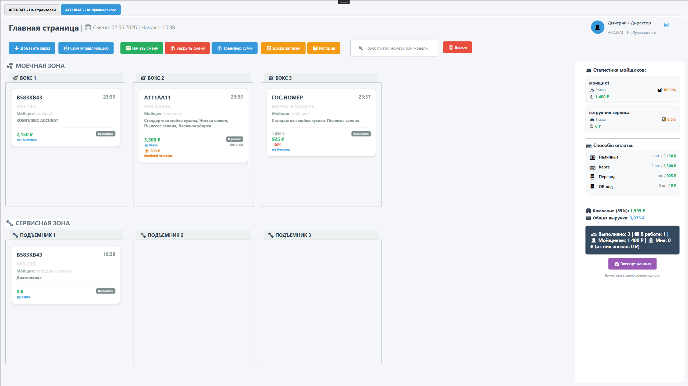
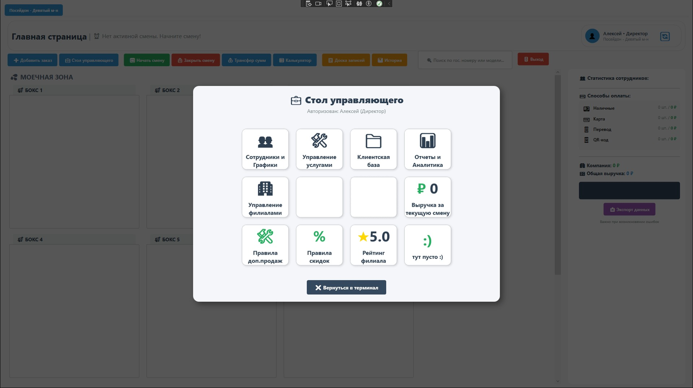
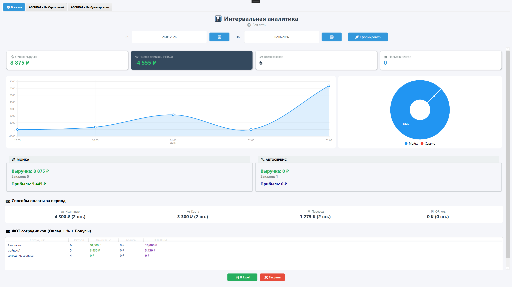
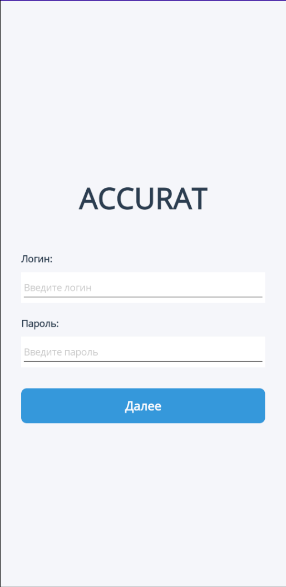
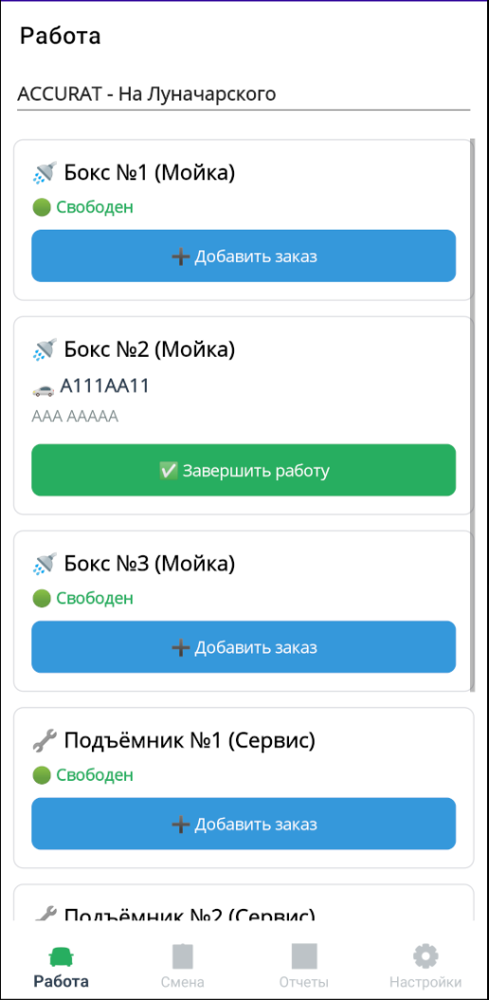
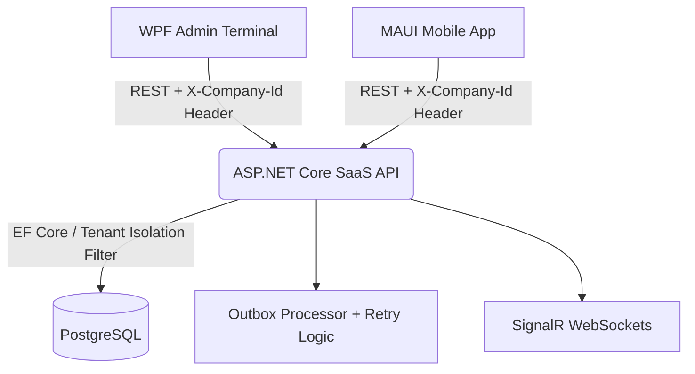

# Accurat System — Комплексная SaaS-платформа управления сетью автомоек и сервисов

## 📝 Описание проекта

**Accurat System** — это мультитенантная (Multi-tenant SaaS) клиент-серверная экосистема для полной автоматизации бизнес-процессов сетей автомоек и автосервисов. Проект спроектирован по принципу монорепозитория (monorepo) и обеспечивает строгую изоляцию данных независимых компаний-клиентов внутри единого серверного ядра.

В состав комплекса входят:

* **Высокопроизводительный десктопный терминал** администратора/кассира (WPF .NET Framework 4.8, паттерн MVVM).
* **Мобильное приложение для управляющих и владельцев** (Кроссплатформенный .NET MAUI).
* **Централизованный отказоустойчивый сервер** (ASP.NET Core REST API) с базой данных PostgreSQL.

## 📸 Скриншоты интерфейса

### Главное окно на ПК:

### Стол управляющего:

### Интервальный отчет:

### Авторизация на смартфоне:

### Главное окно на смартфоне:

## 📐 Архитектура системы

Экосистема использует сквозную контекстную изоляцию. Клиентские приложения при аутентификации получают параметры тенанта, после чего статический пул `HttpClient` (Singleton) автоматически подмешивает во все запросы заголовок `X-Company-Id`. 

**Ключевые инженерные решения:**
* **Server-side Filtering:** Для предотвращения деградации производительности при росте базы данных (проблема «смерти от данных»), фильтрация заказов перенесена с клиента на сторону сервера.
* **Outbox Pattern:** Реализована гарантированная доставка фоновых событий с механизмом контролируемых повторных попыток (`Retry Limit`), что обеспечивает стабильность системы при сбоях внешних сервисов.
* **Real-time Sync:** Использование SignalR для мгновенного обновления состояния рабочих зон на всех терминалах сети.

## 📂 Структура монорепозитория

* **`AccuratPanelCarWashing/`** — Десктопный клиент (WPF). Основное рабочее место кассира-администратора. Управление живой очередью боксов, проводка кассовых операций, расчет апселл-бонусов, синхронизация по WebSockets (SignalR) и локальный экспорт аналитики.
* **`AccuratPanelCWM/`** — Мобильный клиент (.NET MAUI). Оперативный кроссплатформенный пульт контроля с поддержкой динамической смены тем оформления и адаптивным дашбордом.
* **`Accurat.WebAPI/`** — Серверная часть (ASP.NET Core). Центральное REST API ядро системы. Инкапсулирует вычисления, финансовую математику, управление транзакциями и фоновые службы (Background Services).
* **`AccuratSystem.Contracts/`** — Библиотека контрактов. Общие скомпилированные модели данных (`Order`, `User`, `Branch`), DTO-объекты авторизации/смены статусов и перечисления (`Enums`). Обеспечивает строгую типизацию и контрактную целостность между API и клиентами.

## 🌟 Основные возможности

### 🔒 Безопасность и Мультитенантность (SaaS)

* **Enterprise Security:** Внедрено одностороннее хэширование паролей с использованием алгоритма **BCrypt**, что исключает утечку реальных паролей даже при компрометации базы данных.
* **Аутентификация до авторизации:** Двухшаговый вход в систему (`LoginWindow`). Список филиалов скрыт до проверки пароля.
* **Изоляция сущностей:** Услуги (`Service`), клиенты (`Client`), статусы (`OrderStatus`), категории автомобилей и способы оплаты изолированы на уровне `CompanyId`.
* **Режим Бога (God Mode):** Специализированная системная роль `Разработчик` (RoleId = 0), позволяющая администрировать всю сеть компаний.

### 💰 Финансовый модуль и Зарплатное ядро

* **Soft Split (Распределение ЗП):** Связь "многие-к-многим" (`OrderWashers`) позволяет назначать на один заказ команду исполнителей с гибким распределением долей участия.
* **Точная аналитика по ролям:** Дифференцированный расчет KPI: для линейного персонала (мойщики, сервис) — по факту выполненных работ; для руководства — по общему объему выручки смены.
* **Кассовый контроль и Авансирование:** Раздельный real-time учет наличных, карт, переводов и СБП (QR-код). Именная выдача авансов с автоматическим пересчетом ведомости при закрытии смены.

### 📅 Операционный учет и CRM

* **Интерактивная доска:** Мгновенный Drag-and-Drop перенос карточек заказов между боксами и департаментами (Мойка / Сервис).
* **Умный кассир (Upsell DLC):** Алгоритм автоматического анализа состава заказа и выдачи подсказок для допродаж с геймификацией бонусов.
* **Умное расписание:** Посекундный анализ хронологии статусов (`OrderStatusHistory`) для точной аналитики времени нахождения машины в боксе.

## 🚀 Roadmap (Планы развития)

* [x] **Core SaaS System:** Базовый учет, тенанты, сквозные заголовки контекста.
* [x] **Security Hardening:** Внедрение BCrypt хэширования паролей.
* [x] **Scalability Fix:** Перенос фильтрации данных на сторону API для работы с большими объемами.
* [x] **Reliability Update:** Оптимизация Outbox-процессора с лимитом попыток (Retry Limit).
* [x] **Smart Cashier (DLC):** Модуль умных подсказок (Upsell) и калькулятор апселл-бонусов.
* [x] **Smart Staff Management:** Обновленный модуль запуска смен.
* [x] **Перестроить MAUI-проект под новую архитектуру:** Обновленное мобильное приложение с чистыми контрактами.
* [x] **Модуль управления филиалами сети:** Интерактивная настройка параметров филиалов.
* [x] **Модуль Правила скидок:** Позволяет создавать и управлять правилами скидок для клиентов.
* [x] **Закрытие финансовых дыр, первый этап:** Добавлена заморозка сумм, заказов, зарплат.
* [x] **Разделение смен:** Внедрение системы выбора типа смены (День/Ночь) при запуске.
* [ ] **Закрытие финансовых дыр, второй этап:** Дорработка заморозок всех финансовых данных.
* [ ] **Reputation Management Module (DLC):** Агрегатор отзывов (Яндекс, Google, 2ГИС) с ответами из терминала.
* [ ] **CRM-Marketing (DLC):** Автоматическая SMS/Telegram рассылка триггерных уведомлений.
* [ ] **Storage Module (DLC):** Складской учет автохимии, инвентаризация и расчет себестоимости.
* [ ] **Telegram Boss (DLC):** Бот-агрегатор вечерних отчетов и P&L-метрик для владельцев.

## 🛠 Технологический стек

* **Backend:** C# 13, .NET 10, ASP.NET Core, EF Core, PostgreSQL (Npgsql), SignalR, Scalar/Swagger.
* **Desktop Client:** C# 7.3, WPF (.NET Framework 4.8), LiveCharts, ClosedXML, Newtonsoft.Json, SignalR Client.
* **Mobile Client:** C# 13, .NET MAUI (.NET 10), MVVM Architecture.

## ⚙️ Требования к окружению и Запуск

### 1. Серверная часть (API)

1. Установите .NET 10 SDK и СУБД PostgreSQL.
2. Сконфигурируйте строку подключения в `Accurat.WebAPI/appsettings.json`.
3. Примените миграции: `dotnet ef database update`.
4. Запустите Web-сервер: `dotnet run`.

### 2. Клиентская часть

1. Откройте решение `AccuratSystem.sln` в Visual Studio 2022.
2. Проверьте базовый URL сервера в статическом пуле `ApiService`.
3. Запустите проект `AccuratPanelCarWashing` (F5).

## 📄 Лицензия

Распространяется под лицензией [MIT](https://opensource.org/licenses/MIT).

## 👤 Автор

**Dima Kuraedov** ([@iamfifya](https://github.com/iamfifya))

* Telegram: [@iamfifya](https://t.me/iamfifya)
* Email: dimakuraedov@gmail.com

*Продукт спроектирован и разработан с использованием архитектурных рекомендаций больших языковых моделей ИИ.*
