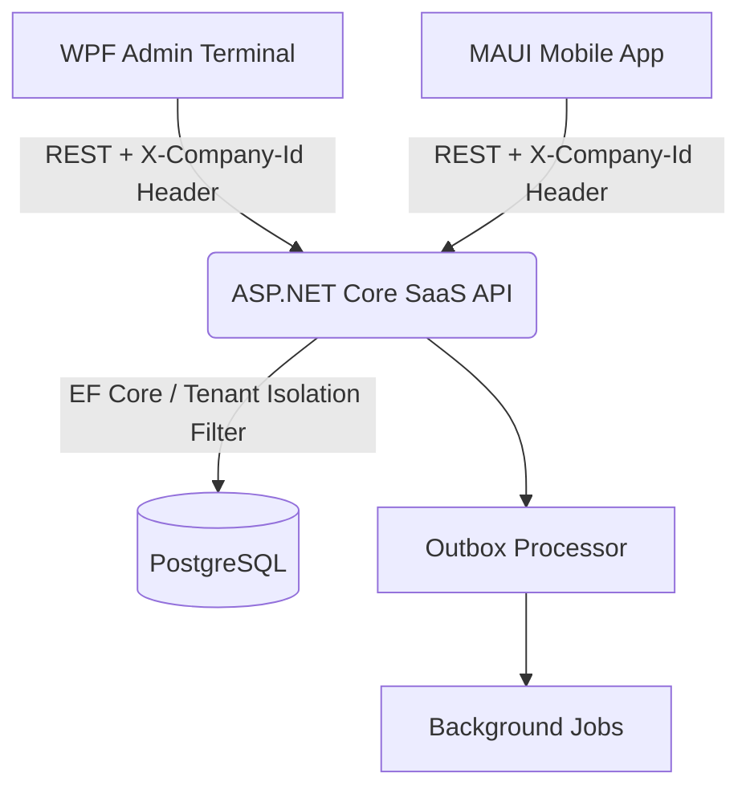

# Accurat System — Комплексная SaaS-платформа управления сетью автомоек и сервисов

## 📝 Описание проекта

**Accurat System** — это мультитенантная (Multi-tenant SaaS) клиент-серверная экосистема для полной автоматизации бизнес-процессов сетей автомоек и автосервисов. Проект спроектирован по принципу монорепозитория (monorepo) и обеспечивает строгую изоляцию данных независимых компаний-клиентов внутри единого серверного ядра.

В состав комплекса входят:

* **Высокопроизводительный десктопный терминал** администратора/кассира (WPF .NET Framework 4.8, паттерн MVVM).
* **Мобильное приложение для управляющих и владельцев** (Кроссплатформенный .NET MAUI).
* **Централизованный отказоустойчивый сервер** (ASP.NET Core REST API) с базой данных PostgreSQL.

## 📐 Архитектура системы

Экосистема использует сквозную контекстную изоляцию. Клиентские приложения при аутентификации получают параметры тенанта, после чего статический пул `HttpClient` (Singleton) автоматически подмешивает во все запросы заголовок `X-Company-Id`. Серверное ядро выполняет валидацию и фильтрацию данных на лету, исключая утечку конфиденциальной информации (баз клиентов, прайс-листов, транзакций) между параллельными компаниями.



## 📂 Структура монорепозитория

* **`AccuratPanelCarWashing/`** — Десктопный клиент (WPF). Основное рабочее место кассира-администратора. Управление живой очередью боксов, проводка кассовых операций, расчет апселл-бонусов, синхронизация по WebSockets (SignalR) и локальный экспорт аналитики.
* **`AccuratPanelCWM/`** — Мобильный клиент (.NET MAUI). Оперативный кроссплатформенный пульт контроля с поддержкой динамической смены тем оформления и адаптивным дашбордом.
* **`Akkurat.WebAPI/`** — Серверная часть (ASP.NET Core). Центральное REST API ядро системы. Инкапсулирует вычисления, финансовую математику, управление транзакциями и фоновые службы (Background Services).
* **`AccuratSystem.Contracts/`** — Библиотека контрактов. Общие скомпилированные модели данных (`Order`, `User`, `Branch`), DTO-объекты авторизации/смены статусов и перечисления (`Enums`). Обеспечивает строгую типизацию и контрактную целостность между API и клиентами.

## 🌟 Основные возможности

### 🔒 Безопасность и Мультитенантность (SaaS)

* **Аутентификация до авторизации:** Двухшаговый вход в систему (`LoginWindow`). Список филиалов скрыт до проверки пароля. Если у пользователя доступен один филиал (мойщик) — вход происходит бесшовно; если несколько (директор сети) — активируется шаг выбора рабочей точки.
* **Изоляция сущностей:** Услуги (`Service`), клиенты (`Client`), статусы (`OrderStatus`), категории автомобилей и способы оплаты изолированы на уровне `CompanyId`. Прайс-листы и базы клиентов не пересекаются.
* **Режим Бога (God Mode):** Специализированная системная роль `Разработчик` (RoleId = 0) выведена из-под матрицы ограничений конкретного тенанта (`CompanyId` установлен в `null`), что открывает сквозной доступ ко всем компаниям и филиалам платформы для администрирования.

### 💰 Финансовый модуль и Зарплатное ядро

* **Soft Split (Распределение ЗП):** Связь "многие-ко-многим" (`OrderWashers`) позволяет назначать на один заказ команду исполнителей с гибким распределением долей участия и выручки.
* **Кастомные тарифные сетки:** Сервер рассчитывает ЗП на основе базового процента сотрудника с возможностью переопределения (индивидуальной ставки) для высокомаржинальных или сложных услуг (например, нанесение защитных покрытий).
* **Кассовый контроль и Авансирование:** Раздельный real-time учет наличных, карт, переводов и СБП (QR-код). Именная выдача авансов из кассы с автоматическим удержанием и перерасчетом ведомости при закрытии смены.

### 📅 Операционный учет и CRM

* **Интерактивная доска:** Мгновенный Drag-and-Drop перенос карточек заказов между боксами и департаментами (Мойка / Сервис) с синхронизацией по SignalR.
* **Умный кассир (Upsell DLC):** Алгоритм автоматического анализа состава заказа и выдачи умных подсказок для допродаж со встроенной геймификацией бонусов для администраторов.
* **Умное расписание:** Посекундный анализ хронологии статусов (`OrderStatusHistory`) для точной аналитики времени нахождения машины в боксе и предотвращения накладок при бронировании.

## 🚀 Roadmap (Планы развития)

* [x] **Core SaaS System:** Базовый учет, тенанты, сквозные заголовки контекста.
* [x] **Smart Cashier (DLC):** Модуль умных подсказок (Upsell) и калькулятор апселл-бонусов.
* [x] **Smart Staff Management:** Обновленный модуль запуска смен (`StartShiftWindow`) с интерактивным поиском и многовыборочным сохранением состояния фильтра.
* [ ] **IsReputationEnabled Module (DLC):** Вызов краткой и развернутой сводки из сервисов для отзывов(Яндекс, Гугл, 2ГИС).
* [ ] **CRM-Marketing (DLC):** Автоматическая SMS/Telegram рассылка триггерных уведомлений по базе.
* [ ] **Storage Module (DLC):** Складской учет автохимии, материалов, инвентаризация и калькуляция себестоимости.
* [ ] **Telegram Boss (DLC):** Бот-агрегатор для отправки вечерних отчетов и P&L-метрик владельцам бизнеса.

## 🛠 Технологический стек

* **Backend:** C# 13, .NET 10, ASP.NET Core, EF Core, PostgreSQL (Npgsql), SignalR, Scalar/Swagger.
* **Desktop Client:** C# 7.3, WPF (.NET Framework 4.8), ClosedXML, Newtonsoft.Json, SignalR Client.
* **Mobile Client:** C# 13, .NET MAUI (.NET 10), MVVM Architecture.

## ⚙️ Требования к окружению и Запуск

### 1. Серверная часть (API)

1. Установите .NET 10 SDK и СУБД PostgreSQL.
2. Сконфигурируйте строку подключения в `Akkurat.WebAPI/appsettings.json`:

```json
{
  "ConnectionStrings": {
    "DefaultConnection": "Host=localhost;Database=accurat_db;Username=postgres;Password=your_password"
  }
}

```

3. Примените миграции для развертывания структуры базы данных:

```bash
cd Akkurat.WebAPI
dotnet ef database update

```

4. Запустите Web-сервер:

```bash
dotnet run

```

### 2. Клиентская часть

1. Откройте решение `AccuratSystem.sln` в Visual Studio 2022.
2. Проверьте базовый URL сервера в статическом пуле `ApiService`.
3. Для запуска десктопа установите `AccuratPanelCarWashing` как запускаемый проект и нажмите **F5**.

## 📄 Лицензия

Распространяется под лицензией MIT. Подробности см. в файле [LICENSE](https://www.google.com/search?q=LICENSE).

## 👤 Автор

**Dmitry Kuraedov** ([@iamfifya](https://github.com/iamfifya))

* Telegram: [@iamfifya](https://www.google.com/search?q=https://t.me/iamfifya)
* Email: dimakuraedov@gmail.com

*Продукт спроектирован и разработан с использованием архитектурных рекомендаций больших языковых моделей ИИ.*
