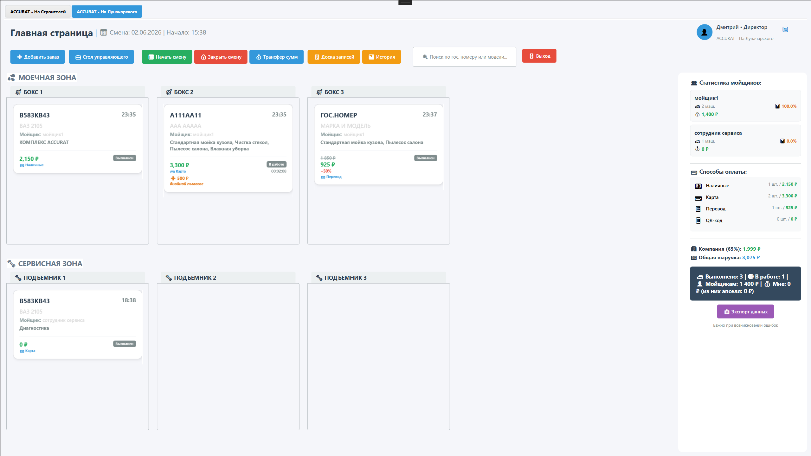
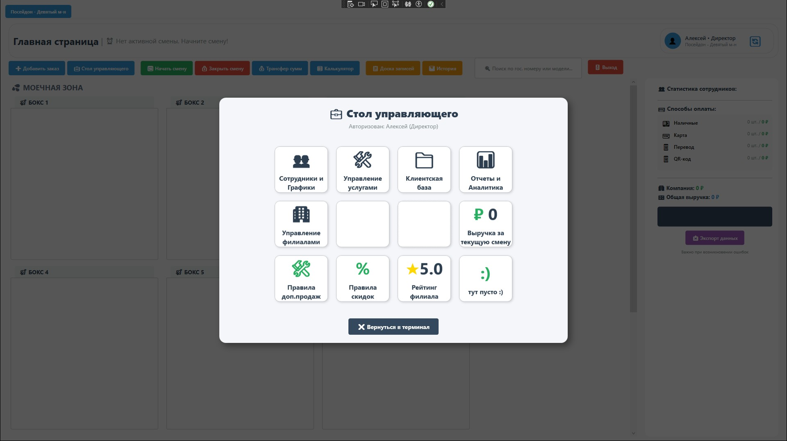
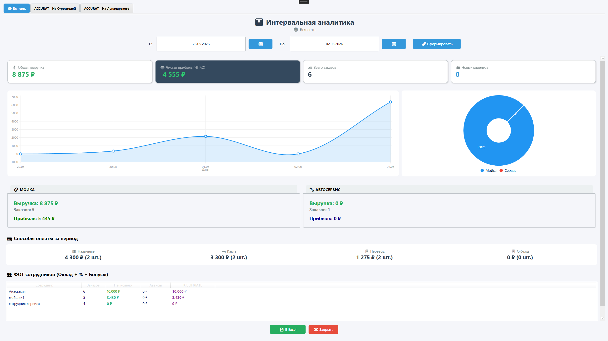
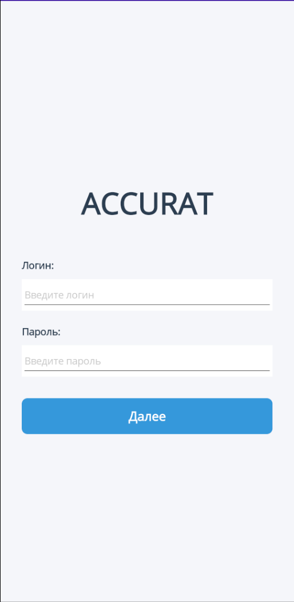
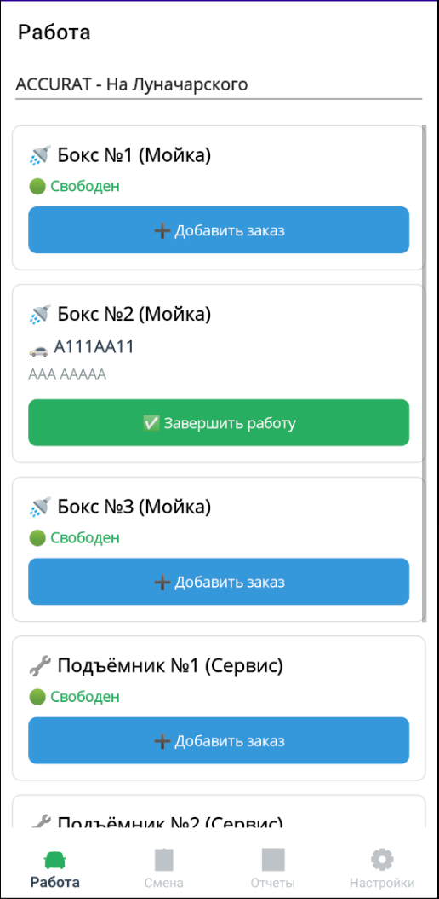
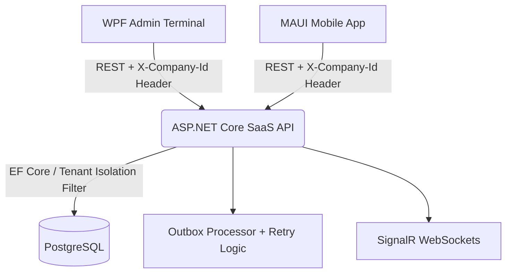

# Accurat System — Комплексная SaaS-платформа управления сетью автомоек и сервисов

---
## 📑 Оглавление

- [📝 Описание проекта](#-описание-проекта)
- [📸 Скриншоты интерфейса](#-скриншоты-интерфейса)
- [📐 Архитектура системы](#-архитектура-системы)
- [📂 Структура монорепозитория](#-структура-монорепозитория)
- [🌟 Основные возможности](#-основные-возможности)
  - [🔒 Безопасность и Мультитенантность (SaaS)](#-безопасность-и-мультитенантность-saas)
  - [💰 Финансовый модуль и Зарплатное ядро](#-финансовый-модуль-и-зарплатное-ядро)
  - [📅 Операционный учет и Аналитика](#-операционный-учет-и-аналитика)
  - [🎨 Интерфейс и UX](#-интерфейс-и-ux)
- [🛠 Технологический стек](#-технологический-стек)
- [⚙️ Требования к окружению и Запуск](#️-требования-к-окружению-и-запуск)
- [📄 Лицензия](#-лицензия)
- [👤 Автор](#-автор)

---

## 📝 Описание проекта

**Accurat System** — это мультитенантная (Multi-tenant SaaS) клиент-серверная экосистема для полной автоматизации бизнес-процессов сетей автомоек и автосервисов. Проект спроектирован по принципу монорепозитория (monorepo) и обеспечивает строгую изоляцию данных независимых компаний-клиентов внутри единого серверного ядра.

В состав комплекса входят:

* **Высокопроизводительный десктопный терминал** администратора/кассира (WPF, частичный паттерн MVVM, полная поддержка Dark Mode).
* **Мобильное приложение для управляющих и владельцев** (Кроссплатформенный .NET MAUI).
* **Централизованный отказоустойчивый сервер** (ASP.NET Core REST API) с базой данных PostgreSQL.

## 📸 Скриншоты интерфейса

<table align="center" style="width: 100%;">
  <tr>
    <td valign="top" width="65%" align="center">
      <b>Главное окно на ПК</b> 
        
      <b>Стол управляющего (обновлено 01.06.2026)</b> 
        
      <b>Интервальный отчет</b> 
      
    </td>
    <td valign="top" width="35%" align="center">
      <b>Авторизация на смартфоне</b> 
        
      <b>Главное окно на смартфоне</b> 
      
    </td>
  </tr>
</table>

## 📐 Архитектура системы

Экосистема использует сквозную контекстную изоляцию. Клиентские приложения при аутентификации получают параметры тенанта, после чего статический пул `HttpClient` (Singleton) автоматически подмешивает во все запросы заголовок `X-Company-Id`. 

**Ключевые инженерные решения:**
* **Server-side Filtering:** Для предотвращения деградации производительности при росте базы данных (проблема «смерти от данных»), фильтрация заказов перенесена с клиента на сторону сервера.
* **Outbox Pattern:** Реализована гарантированная доставка фоновых событий с механизмом контролируемых повторных попыток (`Retry Limit`), что обеспечивает стабильность системы при сбоях внешних сервисов.
* **Real-time Sync:** Использование SignalR для мгновенного обновления состояния рабочих зон на всех терминалах сети.

```mermaid
graph TD
    A[WPF Admin Terminal] -->|REST + X-Company-Id Header| B(ASP.NET Core SaaS API)
    C[MAUI Mobile App] -->|REST + X-Company-Id Header| B
    B -->|EF Core / Tenant Isolation Filter| D[(PostgreSQL)]
    B --> E[Outbox Processor + Retry Logic]
    B --> F[SignalR WebSockets]
```

## 📂 Структура монорепозитория

* **`AccuratPanelCarWashing/`** — Десктопный клиент (WPF). Исторический артефакт (оставлен с исправленной критической финансовой логикой).
* **`AccuratPanelCWD/`** — Десктопный клиент (WPF). Основное рабочее место кассира-администратора. Управление живой очередью боксов, проводка кассовых операций, расчет апселл-бонусов, синхронизация по WebSockets (SignalR), локальный экспорт аналитики и поддержка модульной системы тем.
* **`AccuratPanelCWM/`** — Мобильный клиент (.NET MAUI). Оперативный кроссплатформенный пульт контроля с поддержкой динамической смены тем оформления, адаптивным дашбордом, выбором исторических смен (DatePicker) и «живым» поиском сотрудников.
* **`Accurat.WebAPI/`** — Серверная часть (ASP.NET Core). Центральное REST API ядро системы. Инкапсулирует вычисления, финансовую математику, управление транзакциями и фоновые службы (Background Services).
* **`AccuratSystem.Contracts/`** — Библиотека контрактов. Общие скомпилированные модели данных (`Order`, `User`, `Branch`), DTO-объекты авторизации/смены статусов и перечисления (`Enums`). Обеспечивает строгую типизацию и контрактную целостность между API и клиентами.

## 🌟 Основные возможности

### 🔒 Безопасность и Мультитенантность (SaaS)
* **Enterprise Security:** Внедрено одностороннее хэширование паролей с использованием алгоритма **BCrypt**, что исключает утечку реальных паролей даже при компрометации базы данных.
* **Аутентификация до авторизации:** Двухшаговый вход в систему (`LoginWindow`). Список филиалов скрыт до проверки пароля.
* **Изоляция сущностей:** Услуги (`Service`), клиенты (`Client`), статусы (`OrderStatus`), категории автомобилей и способы оплаты изолированы на уровне `CompanyId`.
* **Режим Бога (God Mode):** Специализированная системная роль `Разработчик` (RoleId = 0), позволяющая администрировать всю сеть компаний.

### 💰 Финансовый модуль и Зарплатное ядро
* **Идеальная финансовая математика:** Устранены исторические неточности в расчете ФОТ и прибыли департаментов. Админский ФОТ корректно раскладывается пропорционально выручке, синхронизированы показатели кассы и отчетов для наличных средств.
* **Soft Split (Распределение ЗП):** Связь "многие-к-многим" (`OrderWashers`) позволяет назначать на один заказ команду исполнителей с гибким распределением долей участия.
* **Точная аналитика по ролям:** Дифференцированный расчет KPI: для линейного персонала (мойщики, сервис) — по факту выполненных работ; для руководства — по общему объему выручки смены.
* **Кассовый контроль и Авансирование:** Раздельный real-time учет наличных, карт, переводов и СБП (QR-код). Именная выдача авансов с автоматическим пересчетом ведомости при закрытии смены.

### 📅 Операционный учет и Аналитика
* **Расширенная аналитика смен:** Внедрены 4 новых метрики в отчёты: расчет среднего чека (TotalRevenue / TotalCars), глубокая статистика по предоставленным скидкам, анализ возвращаемости клиентов (Retention Rate) и детализация топ-5 самых популярных услуг.
* **Интерактивная доска:** Мгновенный Drag-and-Drop перенос карточек заказов между боксами и департаментами (Мойка / Сервис) через attached behavior.
* **Умный кассир (Upsell DLC):** Алгоритм автоматического анализа состава заказа и выдачи подсказок для допродаж с геймификацией бонусов.
* **Умное расписание:** Посекундный анализ хронологии статусов (`OrderStatusHistory`) для точной аналитики времени нахождения машины в боксе.

### 🎨 Интерфейс и UX
* **Модульная система тем:** Внедрен hot-swap тем оформления (Light/Dark Mode) без перезапуска приложения. Все цвета переведены на `DynamicResource` и токены.
* **Унифицированный дизайн:** Более 25 окон и оверлеев переведены на единые стили (`AppStyles.xaml`). Унифицированный `CornerRadius=6` и hover-эффекты для современных интерактивных элементов.
* **Адаптивные компоненты:** Кастомный DatePicker с полной темизацией ячеек календаря и fallback-значениями.

## 🛠 Технологический стек

* **Backend:** C# 13, .NET 10, ASP.NET Core, EF Core, PostgreSQL (Npgsql), SignalR, Scalar/Swagger.
* **Desktop Client:** C# latest, WPF, LiveCharts, ClosedXML, Newtonsoft.Json, SignalR Client.
* **Mobile Client:** C# 13, .NET MAUI, MVVM Architecture.

## ⚙️ Требования к окружению и Запуск

### 1. Серверная часть (API)
1. Установите .NET 10 SDK и СУБД PostgreSQL.
2. Сконфигурируйте строку подключения в `Accurat.WebAPI/appsettings.json`.
3. Примените миграции: `dotnet ef database update`.
4. Запустите Web-сервер: `dotnet run`.

### 2. Клиентская часть
1. Откройте решение `AccuratSystem.slnx` в Visual Studio 2022.
2. Проверьте базовый URL сервера в статическом пуле `ApiService`.
3. Запустите проект `AccuratPanelCWD` (F5).

## 📄 Лицензия
Исходный код проекта доступен по лицензии Business Source License 1.1 (BSL 1.1).
Код полностью открыт для аудита и тестирования. Использование системы в коммерческих целях (для автоматизации работы реальных сетей автомоек и автосервисов) требует приобретения коммерческой подписки (одна компания — одна подписка). По вопросам приобретения подписки обращайтесь к [автору](#-автор).

*Допускается использование в некоммерческих целях. Для коммерческого использования требуется отдельное соглашение.*

## 👤 Автор
**Dima Kuraedov** (@iamfifya)
* Telegram: @iamfifya
* Email: dimakuraedov@gmail.com

*Продукт спроектирован и разработан с использованием архитектурных рекомендаций больших языковых моделей ИИ.*
